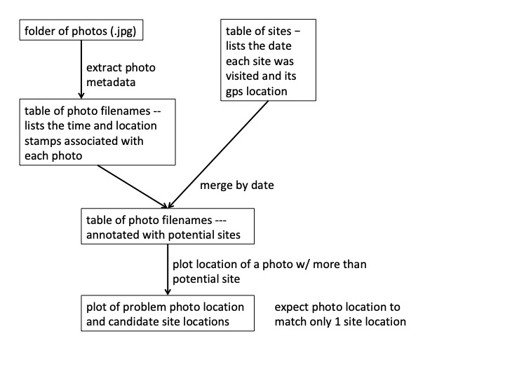

Workflow_presentation
========================================================
author: Marissa Lee
date: 11/27/19

I just learned how to make an **`R presentation`** and it is pretty neat. It turns out that it's hard to keep your text on the slide, so I'm just going to scroll through the .md file on GitHub.

If you're interested in doing something like this, check out details here <https://support.rstudio.com/hc/en-us/articles/200486468>.


Motivation
========================================================

- Do you ever look back at your old notes/code and think -- what the heck was I doing? Crap. I can't even read this.
- Have you ever tried to use someone else's code and you end up banging your head against the wall?
- Do you wish you could easily explain a complex coding/analysis issue to your colleague to get help fast?

If so, then today's class is for you.


========================================================

Today's class is aimed at helping keep you organized.    

It's important to start thinking of your data and code like a lab notebook.     

Remember you lab notebook from chemistry class? That's what most of us should aim for. Your records need to be clear and reproducible so that at the very least your TA (e.g. someone familiar with the process) can figure out what you did and where you might have gone wrong.


Outline
========================================================

1. Data management: 
(i) structure, 
(ii) metadata
 
2. Code management: 
(i) workflow map,
(ii) pseudo-code,
(iii) tidyverse, 
(iv) rmarkdown
 
3. Collaboration with GitHub: 
(i) publish rmarkdown, 
(ii) track changes, 
(iii) issues
  

Data management: structure
========================================================

Table structure
  - No merged cells
  - Avoid empty cells
  - Identify variables with columns, not rows (i.e. long form)

Column names (and filenames)
  - Concise and informative
  - Easy to type
  - No spaces

Excel-specific notes
  - Save each worksheet a stand-alone text file (i.e. csv, txt)
  - Once you have save the .csv never edit it manually. Use your coding skills!


Data management: metadata
========================================================

Each data table should have a "data dictionary". This is an important piece of metadata that will make it easier for you (and others) to use the data even if its been ages since it was collected.

How you set up your data dictionary is up to you, but the most essential part is to describe the data contained in **each column**.     

Elements of the data dictionary:
- Detailed column name
- Unit
- Format, i.e. character, integer with 2 digits
- Summary stats, i.e. column min, max, mean

Check out the data we will be using today (`sites_rand.csv`) and 
it's dictionary (`sites_dataDictionary.csv`)


Code management: workflow map
========================================================

Sometimes we can get lost once we open up R. Often folks (especially newbies) get wrapped up in solving tiny problems and lose sight of the big picture.    

For this reason, it's always a good idea to start with a plan.

I like to draw a workflow to think through the key steps in coding-up an analysis. Here's an example of one I used to write the code we will be working with today...




Code management: pseudo-code
========================================================

Now you're like... Ok I've got a plan, I'm going to open up a new R Script and go. Wait a sec. Do yourself a big favor and write out what you want to do in **pseudo code**.

This is incredibly helpful for    
- Attacking complex coding problems
- Troubleshooting errors
- Annotating your code with detail after it works!      

Here's an example of the pseudo code I wrote for today...


```r
# make a list of photo filenames

# extract metadata from photo files

# keep just the metadata that identifies when and where the photo was taken

# load the site data

# use the site data collection dates to identify a list of potential sites for each photo

# since we sometimes sampled more than one site in a day, there will be photos with more than one potential site identifier.

# pick one of these photos where there are 2 potential sites; plot the potential site data gps data and the photo gps data to determine where the photo was taken
```


Code management: tidyverse
========================================================

I love R, but it can be ugly. Fortunantely, Hadley Wickham et al have created a bunch of tools to tame R syntax in a way that is much more read-able and write-able. I strongly urge you all to check out the **tidyverse** (https://www.tidyverse.org/packages/). There are many tools that you are probably already familiar with e.g. ggplot and dplyr.

I'm going to show you a comparison of dplyr vs base R. This should be somewhat familiar from Amy's intro to dplyr at the beginning of the semester. 

Syntax comparison
========================================================
base R

```r
photo.df <- photo.df[,c("FileName", "DateTimeOriginal")] 
dates <- unlist(lapply(strsplit(photo.df$DateTimeOriginal, " "), function(x) x[1]))
month <- unlist(lapply(strsplit(dates, ":"), function(x) x[2]))
day <- unlist(lapply(strsplit(dates, ":"), function(x) x[3]))       
month<-as.integer(month)   
day<-as.integer(day)   
photo.df.c <- data.frame(FileName = photo.df$FileName, 
           month, 
           day)
```

dplyr

```r
photo.df %>%
  select(FileName, DateTimeOriginal) %>%
  separate(DateTimeOriginal, into = c("date","time"), sep = " ", remove = F) %>%
  separate(date, into = c("year","month","day"), remove = T) %>%
  mutate(month = as.integer(month)) %>%
  mutate(day = as.integer(day)) %>%
  select(-c(year, time)) -> photo.df.c
```


Code management: rmarkdown
========================================================

Ok, now we have awesome read-able R code. But our ability to comment within the code is limited to stuff we can fit behind a hashtag. 

**R markdown** is a really helpful tool to annotate analyses with detail. 

Cheatsheet for R markdown: https://www.google.com/search?client=safari&rls=en&q=R+markdown+cheatsheet&ie=UTF-8&oe=UTF-8

Go ahead and open up this .Rmd file (`Rmarkdown_identifyPhotos.Rmd`).
Find the "Knit" button at the top of the script in RStudio.
Click "Knit to GitHub document" and check out what happens


Collaboration with GitHub: publish rmarkdown
========================================================

Now that you know how to write R markdown and turn it into pretty html or pdf files ...
You probabaly want to show it off and share with your colleagues to discuss big science ideas. Here's where GitHub comes in.

First, let me show you what these files look like on GitHub.  
Now, you're turn to publish.

- Make a copy of the .Rmd file and add your initials to the filename
- Add a note about what you had for breakfast this morning in the .Rmd file
- Click "knit" to produce the pretty .md file
- Commit the two new files (.Rmd and .md) to GitHub
- Check it out


Collaboration with GitHub: track changes
========================================================

A great thing about GitHub is that you can collaboratively work on the same code. Of course, this could be a logistical nightmere if you didn't know what was changed, when, and by whom.

I just want to point out some features that I regularly use for this purpose. I certainly do not use GitHub to its full capacity here. Let's start by seeing who's done what to this repo recently.


Collaboration with GitHub: issues
========================================================

What if you want to get nitty-gritty feedback on the code?
Here's where GitHub Issues can be very useful.

Let's check out the Issues tab and see what's in there.
Try creating an issue that references particular lines of .Rmd file that you or your neighbor just added to the repo. (Always remember to be nice!)

